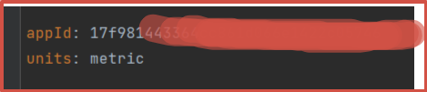
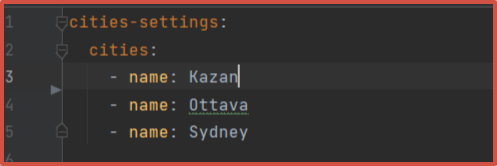
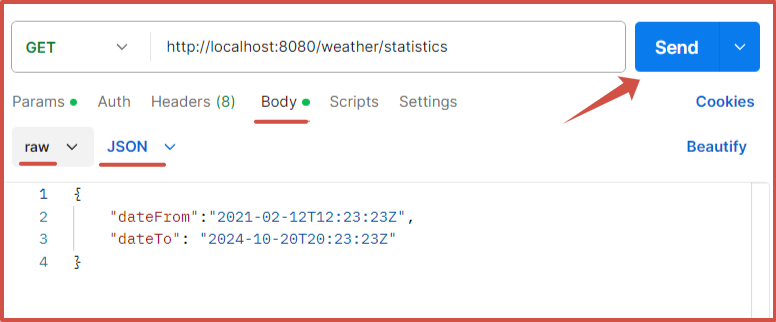
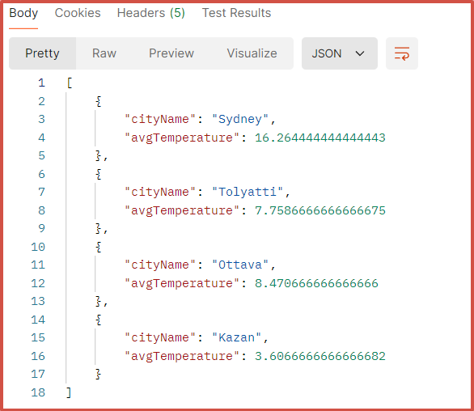
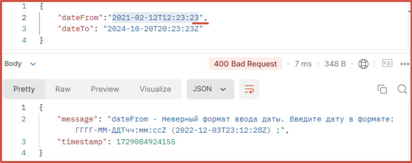
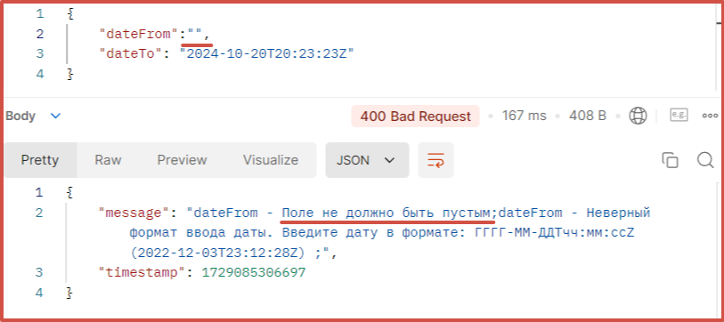

<h1 align="center">Описание проекта.</h1>

<h3 align="center">Данное приложение каждую минуту получает данные о погоде в трех произвольных городах 
  и выводит среднюю температуру по каждому городу за выбранный пользователем период.</h3>
 

<b>Важно:</b> Перед запуском приложения убедитесь, что на вашем компьютере уже предустановлены 
 - Docker 
 - сборщик Maven
 - БД Postgres
 - Postman (для проверки работоспособности)

Также:
 - зарегистрироваться на бесплатном сервисе <b>OpenWeather</b> для получения ключа <b>'appId'</b>

<b>Перед запуском:</b> (после того, как вы скопировали проект на локальный компьютер)
- получите ключ для получения данных о погоде, скопируйте его и вставьте в настраиваемый параметр, который указан в конфигурационном файле <b>application.yaml</b>. Данный файл находится в корне проекта.

<h2 align="center">
  
</h2>

- укажите города, для которых вы хотите собирать данные о погоде. (эти параметры также находятся в файле <b>application.yaml</b>).
Названия городов указываются только английскими буквами в соответствии с международными стандартами.

<h2 align="center">
  
</h2>

<b>Для запуска приложения необходимо:</b>
1. Скопировать проект с удаленного репозитория GitHub к себе на локальный компьютер.
2. Перейти в терминале командной строки в корневую папку проекта.
3. Выполнить команды:
	- <b><i>mvn clean package</i></b> (собираем проект в исполняемый jar-файл)

	- <b><i>docker-compose up -d</i></b> (запускаем контейнеры приложения и БД)
 

<h3 align="center">Ограничения на входные данные и формат ввода.</h3>
 

1. Запускаем приложение Postman.
2. В строке ендпоинта нашего API вводим адрес: <b>http://localhost:8080/weather/statistics</b>
3. В типе запроса выбираем <b>"GET"</b>
4. Устанавливаем переключатель на <b>"Body" -> "row"</b> и выбираем формат передачи данных как <b>"JSON"</b>
5. Вводим наши данные в формате "ключ - значение". Здесь мы должны указать диапазон дат в формате <b>ISO 8601</b>
6. Ключами являются параметры <b>"dateFrom"</b> - нижняя граница диапазона и <b>"dateTo"</b> - верхняя граница диапазона.
7. Через двоеточие для каждого параметра задаем дату (также указывается в кавычках) <b>"БЕЗ ПРОБЕЛОВ"</b> в формате <b>"гггг-ММ-ддТчч:мм:ссZ"</b>, где:
   - <b>гггг</b> - год,
   - <b>ММ</b> - месяц,
   - <b>чч</b> - число,
   - <b>Т</b> - специальный символ (оставляем без изменения),
   - <b>чч</b> - часы,
   - <b>мм</b> - минуты,
   - <b>сс</b> - секунды,
   - <b>Z</b> - специальный символ (оставляем без изменения)
8. Отправляем запрос на выполнение с помощью кнопки <b>"Send"</b>. (Смотри рисунок ниже)

<h2 align="center">
  
</h2>

После отправки запроса мы получим ответ также в формате <b>"ключ - значение"</b>. Данные будут отсортированы по убыванию от максимального значения вхождения символа до минимального (Смотри рисунок ниже).

<h2 align="center">
  
</h2>

В случае некорректного ввода данных предусмотрены ошибки:
- неверный формат:
 
<h2 align="center">
  
</h2>

- пустое поле для даты:

<h2 align="center">
  
</h2>
  

